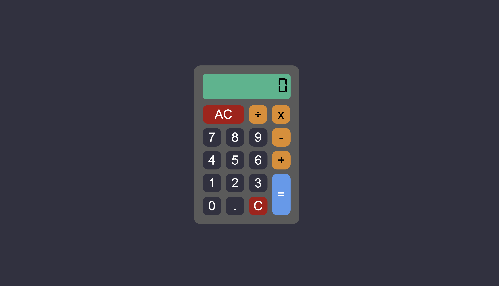

# Calculator

The Calculator project is the final assignment of The Odin Project's Foundations course. The goal is to build a working on-screen calculator using HTML, CSS, and JavaScript that performs the four basic arithmetic operations (addition, subtraction, multiplication, and division).

## Assignment

- Create functions for all the basic math operators: `add`, `subtract`, `multiply`, `divide`.
- A calculator operation consists of a number, an operator, and another number (e.g. `3 + 5`). Create three variables, one for each part of the operation, to be used to update the display later.
- Create an `operate` function that takes an operator and two numbers and calls one of the above functions on the numbers.
- Create a basic HTML calculator with buttons for each digit and operator (including `=`) and a `clear` button.
- Create functions that update one of your number variables when digit buttons are clicked, and update the display to reflect the value of that number variable.
- Make the calculator work: store the first and second numbers, then `operate()` on them when `=` is pressed, according to the operator selected between the numbers. Once operate has been called, update the display with the result.

## Gotchas to pay attention to

- The calculator should not evaluate more than a single pair of numbers at a time. Pressing a second operator should evaluate the current pair and display the result, then use that result as the first number of the next operation (e.g. `12 + 7 - 1 =` → shows `19`, then `18`).
- Round answers with long decimals so they don't overflow the display.
- Pressing `=` before entering all numbers or an operator could cause problems.
- Pressing "clear" should wipe out any existing data so the user really starts fresh.
- Display an error message if the user tries to divide by `0`, and don't let it crash the calculator.
- Only run an operation when supplied with two numbers and an operator. Pressing an operator twice consecutively should not evaluate; it should just take the last operator entered for the next operation.
- When a result is displayed, pressing a new digit should clear the result and start a new calculation instead of appending to the existing result.

## Extra credit

- Add a `.` button so users can input decimals, but don't let them type more than one decimal separator (disable the `.` button if there's already one in the display).
- Add a `backspace` button so the user can undo their last input.
- Add keyboard support.

## Demo

- [Try it here](https://circobit.github.io/calculator/)

## Screenshots

